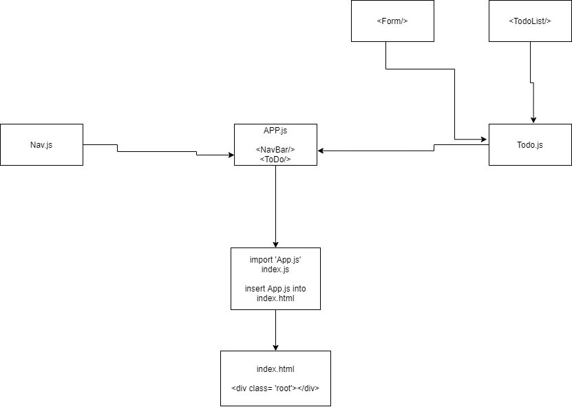

# To-Do App

## Author: Mark Duenas

[Deployed Link](https://app.netlify.com/sites/todo-app-simple/overview)

[Pull Req](https://github.com/MarkDuenas/to-do/pull/1)

## Set up

### Running the app

- npm i - install all dependencies.

- npm start

### Testing

- npm test

### UML

